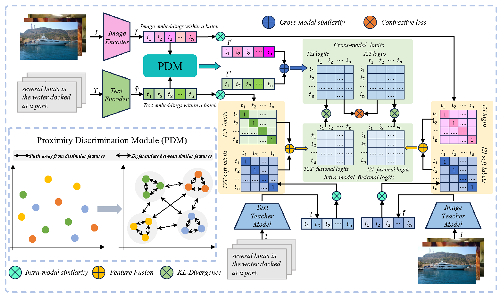

# Intra-modal Consistency for Image-text Retrieval through Soft-label Distillation
## Oeverview
 We propose a novel ITR approach ICSD to implement soft-label distillation by transferring the knowledge from both internal intra-modal similarity and external intra-modal similarity to the cross-modal similarity. In addition, our designed (i) PDM greatly distinguishes different features to avoid erroneous matching information, and (ii) ISF organically fuses internal intra-modal similarity and external intra-modal similarity to effectively guide the model training.


## code structure
```bash
./configs
  ./vitb32    <= configs for vitb32
  ./vitl14    <= configs for vitl14

./datasets    <= datasets

./icsd
  ./models    <= models

evaluation.py <= evaluation

retrieval.py  <= retrieval

```
## Environment Installation


<details>
<summary>For training and limited evaluation</summary>

```bash
# python >= 3.9
pip install torch==2.0.1 torchvision==0.15.2 torchaudio==2.0.2 --index-url https://download.pytorch.org/whl/cu118
pip install transformers sentence-transformers tqdm scikit-learn ftfy
```

</details>


## Data Preprocessing

<details>
<summary>
Image Text Retrieval training/evaluation
</summary>

You should see albef (https://github.com/salesforce/ALBEF) to build a dataset.

For more data examples, 

Here is the data format:
`train.json`
```json
[
  {
        "image_path": "<absPath>/COCO_val2014_000000391895.jpg",
        "caption": "A man with a red helmet on a small moped on a dirt road. ",
        "image_id": "COCO_val2014_000000391895.jpg"
  },
]
```

`train_unicom.npy`
```json
{ "<image_id>1": "<feature>", }
```

</details>


## Tasks
### Training
```bash
# For COCO:
CUDA_VISIBLE_DEVICES=0,1,2,3 torchrun --nproc_per_node=4 --master-port 15160 retrieval.py --config "./configs/vitb32/coco/icsd.yaml"
CUDA_VISIBLE_DEVICES=0,1,2,3 torchrun --nproc_per_node=4 --master-port 15160 retrieval.py --config "./configs/vitl14_336/coco/icsd.yaml"

# For Flick30k:
CUDA_VISIBLE_DEVICES=0,1,2,3 torchrun --nproc_per_node=4 --master-port 15160 retrieval.py --config "./configs/vitb32/flickr/icsd.yaml"
CUDA_VISIBLE_DEVICES=0,1,2,3 torchrun --nproc_per_node=4 --master-port 15160 retrieval.py --config "./configs/vitl14_336/flickr/icsd.yaml"

```


## Checkpoint
We release our trained checkpoints, download them from the [link](https://pan.baidu.com/s/1Hfk2YpJ3_nz-c_vdQ3eZPA?pwd=u4mv).


